[](https://travis-ci.org/IBM/global-financing-blockchain)

# Global financing with blockchain

ブロックチェーンテクノロジを使用したグローバルファイナンスアプリケーションは、購入者、販売者、プロバイダ、荷送人、および金融会社など、ネットワークのさまざまなメンバーによる注文に対するアクションを追跡します。 これらのアクションは次のとおりです。

* バイヤーが注文を作成します
* 売り手は商品の提供元に連絡します
* 荷送人は商品を配達します
* 金融会社は売り手への支払いを処理します

このユースケースは商品購入などに伴い揉め事が発生した際の解決に対処でき、業界のあらゆる分野に適用できます。
ここではBob DillによるRedBookチュートリアル [use case](https://www.redbooks.ibm.com/Redbooks.nsf/RedbookAbstracts/crse0401.html?Open) より、同じアプリケーションインターフェースを使用しています。 このユースケースでは、Node.jsスマートコントラクトとNode.js Webアプリケーションを使用しています。

このCode Patternは、IBM Blockchain Platform Extension for VS Codeを使用してNode.jsスマートコントラクトをパッケージ化する方法を示しています。 次に、この拡張機能を使用して、Hyperledger Fabricネットワークのローカルインスタンスをセットアップし、その上にコントラクトをインストールしてインスタンス化できます。 Node.js Webアプリケーションは、 'fabric-network' sdkを使用してネットワークと対話できます。

このCode Patternを一通り完成させると、以下のことが理解できます。

* Node.jsスマートコントラクトの開発
* VS Code用 IBM Blockchain Platform Extensionを使用し、スマートコントラクトをパッケージ化した、Hyperledger Fabric ローカルインスタンスへのデプロイ
* デプロイされたFabricネットワークとやり取りするためのNode.jsブロックチェーンWebアプリケーションの開発

# Architecture flow

<p align="center">
  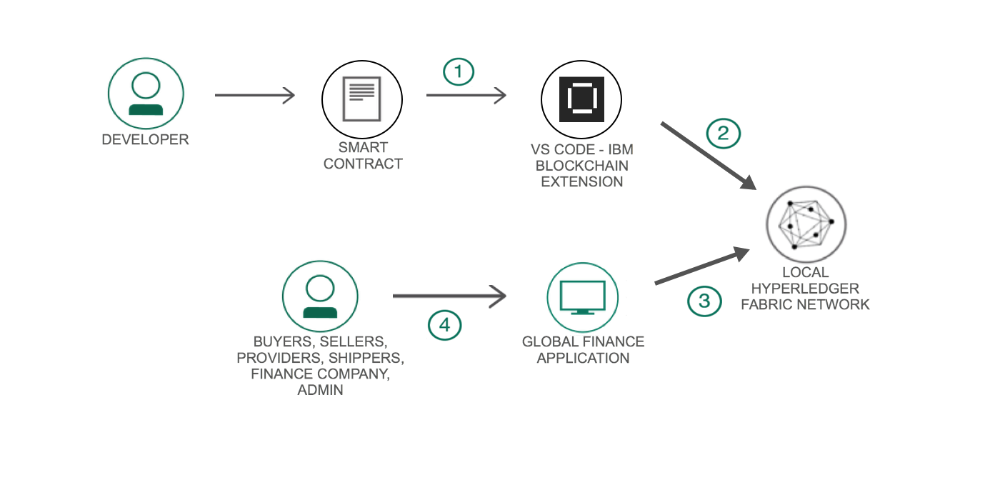
</p>

VS Code用のIBM Blockchain Platform Extensionを使用して、以下のことを行います。

1. スマートコントラクトをパッケージ化します。
1. ローカルのHyperledger Fabric Networkを起動します。
1. ピアノードにチェーンコードをインストールします。
1. ピアノードでチェーンコードをインスタンス化します。
1. Global Financeアプリケーションを使って、 `fabric-network` npmライブラリを使ったAPI呼び出しを通してHyperledger Fabricネットワークとやり取りします。管理者はアプリケーションを使用して新しい参加者を作成することもできます。

# Included components

* [IBM Blockchain Platform Extension for VS Code](https://marketplace.visualstudio.com/items?itemName=IBMBlockchain.ibm-blockchain-platform)  は、Hyperledger Fabric環境への接続を含む、スマートコントラクトの開発、テスト、および展開を支援するように設計されています。
* [Hyperledger Fabric v1.4](https://hyperledger-fabric.readthedocs.io) は、高度な機密性、回復力、柔軟性、およびスケーラビリティを提供するモジュラーアーキテクチャーに支えられた分散型元帳ソリューションのプラットフォームです。
* [Visual Studio Code](https://code.visualstudio.com/download) は、最新のWebおよびクラウドアプリケーションの構築およびデバッグ用に再定義および最適化されたコードエディタです。

## Featured technologies

+ [Node.js](https://nodejs.org/en/) は、サーバーサイドのJavaScriptコードを実行する、オープンソースのクロスプラットフォームのJavaScriptランタイム環境です。
+ [Bootstrap](https://getbootstrap.com/) は、HTML、CSS、およびJavaScriptで開発するためのオープンソースのツールキットです。

## Running the application

このコードパターンを設定して実行するには、次の手順に従います。 ステップの詳細は以下のとおりです。

### Prerequisites

You will need to follow the requirements for the [IBM Blockchain Platform Extension for VS Code](https://github.com/IBM-Blockchain/blockchain-vscode-extension/blob/master/README.md#requirements):

- [VSCode version 1.26 or greater](https://code.visualstudio.com)
- [Node v8.x or greater and npm v5.x or greater](https://nodejs.org/en/download/)
- [Yeoman (yo) v2.x](http://yeoman.io/)
- [Docker version v17.06.2-ce or greater](https://www.docker.com/get-docker)
- [Docker Compose v1.14.0 or greater](https://docs.docker.com/compose/install/)

### Steps

1. [Clone the repo](#1-clone-the-repo)
2. [Use the VS Code extension to set up a smart contract on a basic Fabric network](#2-use-the-vs-code-extension-to-set-up-a-smart-contract-on-a-basic-fabric-network)
3. [Run the application](#3-run-the-application)


## 1. リポジトリのクローン

任意のフォルダにリポジトリをCloneします:

```
git clone https://github.com/IBM/global-financing-blockchain.git
```


## 2. VS Code extension を使用して、基本的なFabricネットワークにスマートコントラクトを設定する

Visual Studio Code を開き `contract` フォルダを開きます。

### スマートコントラクトをパッケージ化する

VS Codeの他のオプションを見るために `F1` キーを押してください。
その中から `IBM Blockchain Platform: Package a Smart Contract Project` を選択します。

<p align="center">
  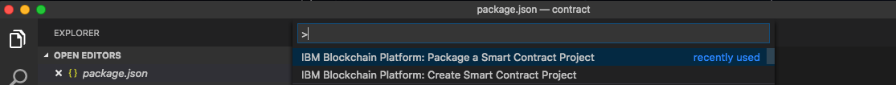
</p>

左側の `IBM Blockchain Platform` 拡張ボタンをクリックしてください。 これにより、パッケージ化されたコントラクトが一番上に表示され、ブロックチェーン接続が一番下に表示されます。

<p align="center">
  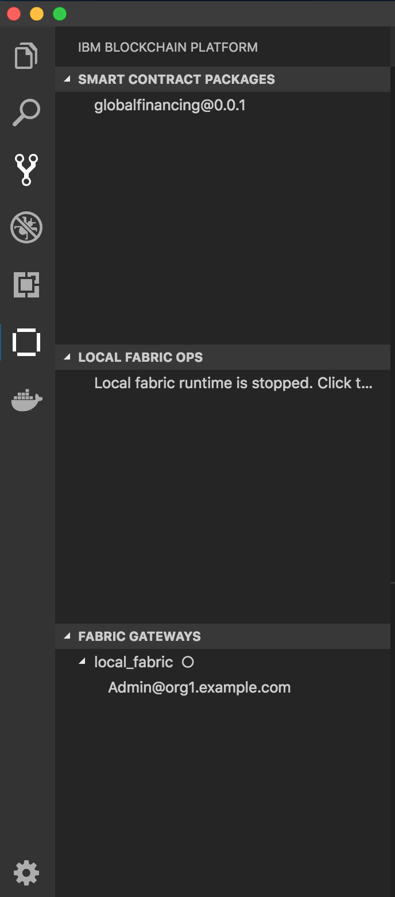
</p>

### ローカルでファブリックを設定する

`LOCAL FABRIC OPS` のメニューをクリックし `Start Fabric Runtime` を選択してネットワークを起動します。 これにより、ローカルのFabric設定に必要なDockerイメージがダウンロードされ、ネットワークが起動します。 ネットワークが設定されると、出力ウィンドウが表示されます。

<p align="center">
  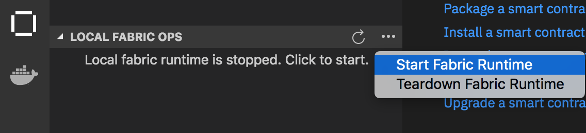
</p>

これで `LOCAL FABRIC OPS` の下に、スマートコントラクトをインストールしてインスタンス化するためのオプション、あなたの `Channels` の情報、 `Nodes` の下のピア、そして `Organizations` の下の organization msp が表示されます。
※MSP(メンバーシップ・サービス・プロバイダ)については [こちら](https://cloud.ibm.com/docs/services/blockchain?topic=blockchain-ibp-console-organizations#ibp-console-organizations) をご覧ください。


<p align="center">
  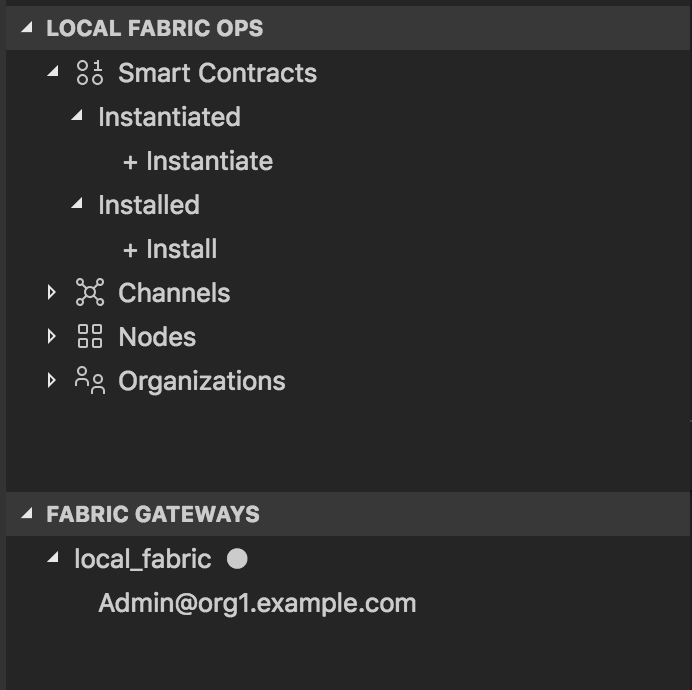
</p>

### スマートコントラクトをインストールしてインスタンス化する

`LOCAL FABRIC OPS` コンソールの `Installed` ドロップダウンの下にある `+Install` をクリックしてください。

こちらのピアを選択します: `peer0.org1.example.com`.

<p align="center">
  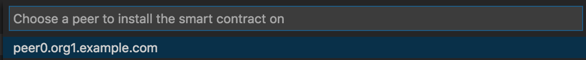
</p>

`globalfinancing@0.0.1` コントラクトを選択します:

<p align="center">
  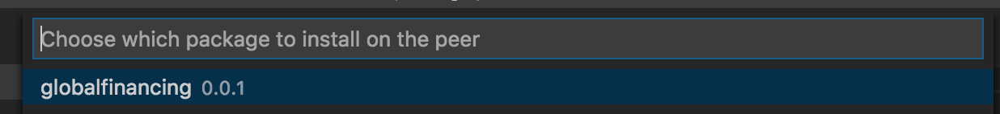
</p>

スマートコントラクトのインストールが成功したことの通知と `LOCAL FABRIC OPS` コンソールの `Installed` の下にリストされているスマートコントラクトが表示されます。

<p align="center">
  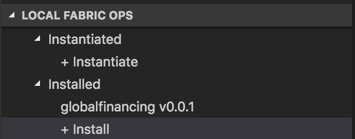
</p>

これでスマートコントラクトをインスタンス化する準備が整いました。
`LOCAL FABRIC OPS` コンソールの `Instantiated` ドロップダウンの下の `+Instantiate` をクリックしてください。

こちらのチャネルを選択します: `my channel`.

<p align="center">
  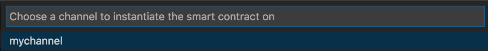
</p>

`globalfinancing@0.0.1` コントラクトを選択します:

<p align="center">
  
</p>

関数に `instantiate` と入力します:

<p align="center">
  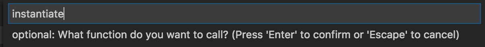
</p>

オプションの引数については **Enter** を押すことができます。

これがうまくインスタンス化されると、アウトプットビューに成功した通知とあなたの `LOCAL FABRIC OPS` コンソールの `Instantiated` の下にリストされたスマートコントラクトが見えるはずです。

<p align="center">
  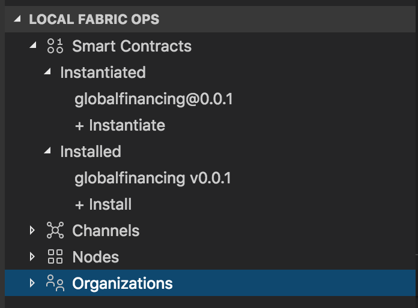
</p>

### CAノードにIdentityを追加する

GitHubからCloneしたソースコードの中にIdentityの情報や認証に使用する鍵ファイルも含まれていますが、ご自身の環境に合わせ書き換える（置き換える）必要があります。先ずは、CAノードにIdentityを追加します。
`LOCAL FABRIC OPS` コンソールの `Nodes` ドロップダウンの下の `ca.org1.example.com` を右クリックして `Create Identity` を選択してください。表示された入力ボックスに `User1@org1.example.com` を入力しEnterを押します。

<p align="center">
  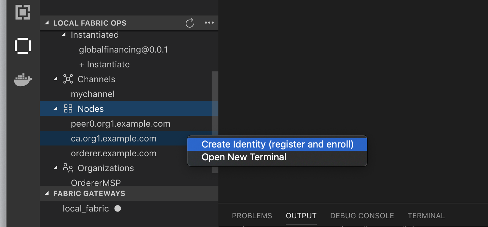
</p>

すると `FABRIC WALLETS` コンソールの `local_fabric_wallet` の配下に `User1@org1.example.com` が追加されたのが確認できます。

<p align="center">
  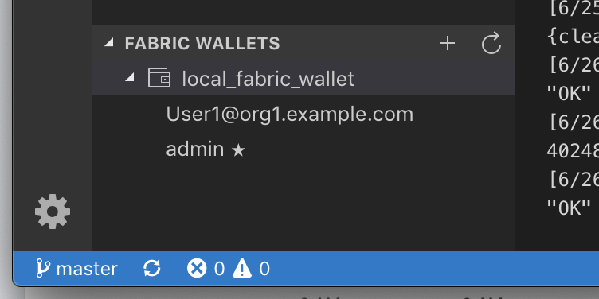
</p>

### Walletをエクスポートする

追加したIdentityの情報をアプリケーションが認証に使えるようにするため、VS CodeのExtensionからWalletをエクスポートします。エクスポート先は任意の場所で結構です。ここではデスクトップに一旦保存しています。

<p align="center">
  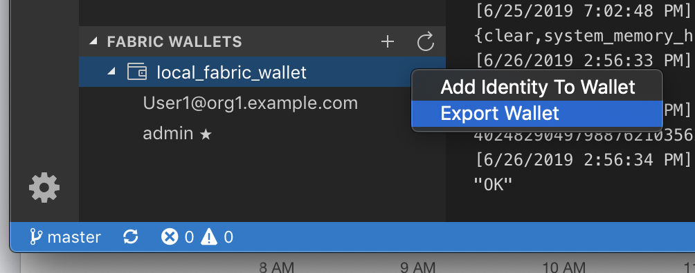
</p>
<p align="center">
  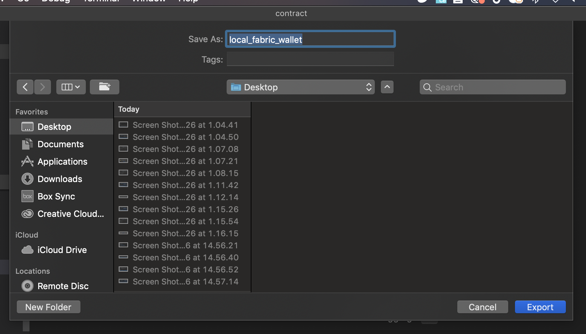
</p>

アプリケーションが認証処理で参照するディレクトリに、エクスポートしたファイルをコピーします。対象のディレクトリは以下になります。
GitHubからCloneしたファイルが既に存在していますので、それらは削除して下さい。
  ```
  /global-financing-blockchain/web-app/controller/restapi/features/fabric/_idwallet/User1@org1.example.com
  ```

<p align="center">
  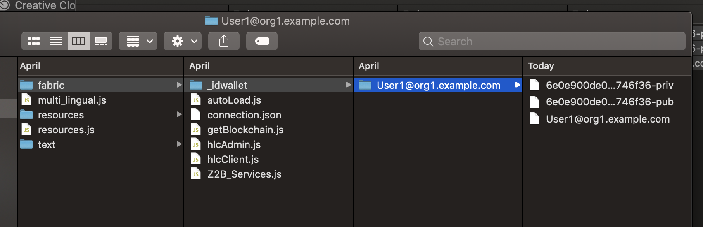
</p>

これで、アプリケーションからブロックチェーンネットワークへの認証が可能になりました。

## 3. アプリケーションの実行

新しいターミナルで `web-app` ディレクトリへ移動します:

  ```bash
  cd global-financing-blockchain/web-app/
  ```

  Build the node dependencies:
  ```bash
  npm install
  ```

  Run the application:
  ```bash
  npm start
  ```

<div style='border: 2px solid #f00;'>
  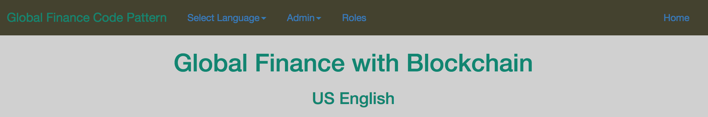
</div>

Unified member's view:
<div style='border: 2px solid #f00;'>
  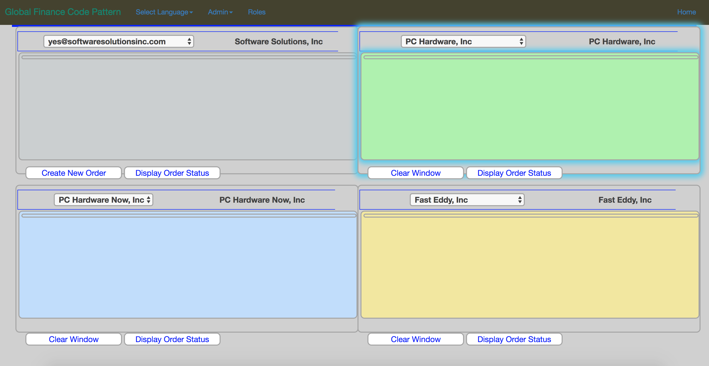
</div>

## トラブルシューティング

* もしこのようなエラーが発生した場合:
`error: [Remote.js]: Error: Failed to connect before the deadline URL:grpc://localhost:17051
error: [Network]: _initializeInternalChannel: Unable to initialize channel. Attempted to contact 1 Peers. Last error was Error: Failed to connect before the deadline URL:grpc://localhost:17051`

このエラーは、connection.jsonファイルでオーダー/認証局/ peerに使用されているポートが、VS Code用のIBM Blockchain Platform Extensionのsettings.jsonファイルでデフォルトのポートとして指定されているものと同じではないために発生したものです。settings.jsonファイルに指定されているものと一致するように、connection.jsonファイル内のポートを更新する必要があります。

左端にある歯車アイコンのボタンをクリックし、`Settings`を選択します。左側のナビゲーションパネル内の`Extensions`が展開され、"Settings"タブが新しく開き、`Blockchain configuration`を選択します。`Edit in settings.json`をクリックしてBlockchain platform extension用のsettings.jsonファイルを開きます。次のような内容が記載されていることが確認できると思います:
```
{
    "ibm-blockchain-platform.fabric.runtime": {
        "ports": {
            "orderer": 17053,
            "peerRequest": 17057,
            "peerChaincode": 17058,
            "peerEventHub": 17059,
            "certificateAuthority": 17060,
            "couchDB": 17061,
            "logs": 17062
        },
        "developmentMode": false
    },
    "ibm-blockchain-platform.fabric.wallets": [],
    "ibm-blockchain-platform.fabric.gateways": []
}
```

あなたのプロジェクト用のconnection.jsonファイルの中のorderer、peerそしてCAポートをこのsettings.jsonファイルで指定された `orderer`、` peerRequest`そして `certificateAuthority`ポートに置き換えてください。


## このCode Patternの拡張
このアプリケーションは、いくつかの方法で拡張できます。
* すべてのメンバーのためのWalletを作成し、アプリケーションと対話するためにメンバーのWalletを使用してください。
* IBM Cloud上のIBM Blockchain Platformスターター・プランを通じて対話するようにアプリケーションを更新します。

## 関連リンク
* [Hyperledger Fabric Docs](http://hyperledger-fabric.readthedocs.io/en/latest/)
* [Zero to Blockchain](https://www.redbooks.ibm.com/Redbooks.nsf/RedbookAbstracts/crse0401.html?Open)
* [IBM Code Patterns for Blockchain](https://developer.ibm.com/patterns/category/blockchain/)

## ライセンス
このCode Patternは、Apache Software License、Version 2の下でライセンスされています。このCode Pattern内で呼び出される個別のサードパーティコードオブジェクトは、それぞれのプロバイダによって、独自の個別のライセンスに従ってライセンスされています。
Contributions are subject to the [Developer Certificate of Origin, Version 1.1 (DCO)](https://developercertificate.org/) and the [Apache Software License, Version 2](https://www.apache.org/licenses/LICENSE-2.0.txt).

[Apache Software License (ASL) FAQ](https://www.apache.org/foundation/license-faq.html#WhatDoesItMEAN)
