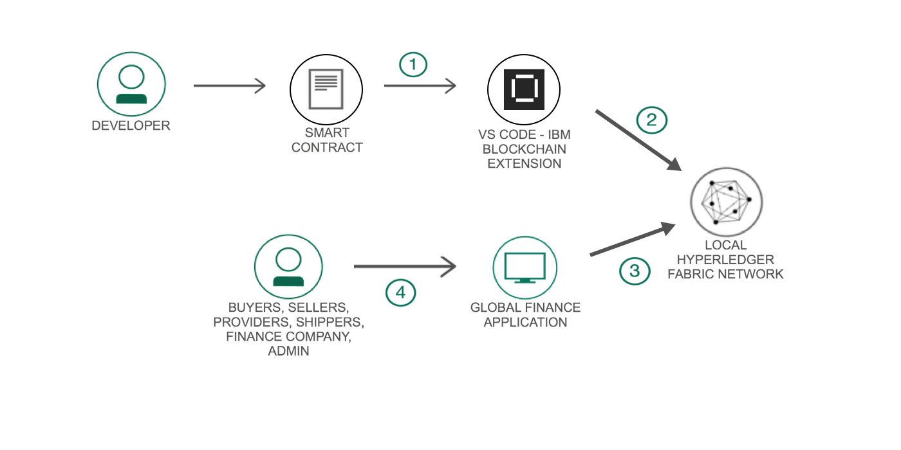
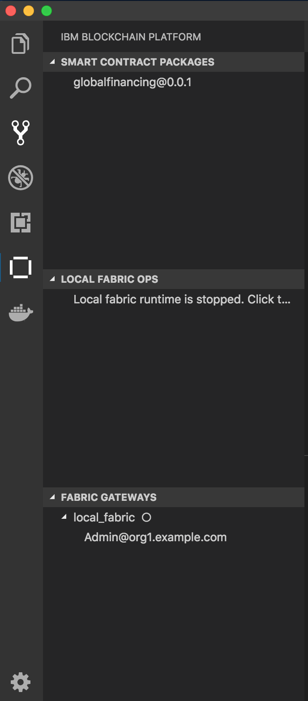
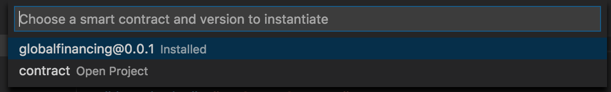
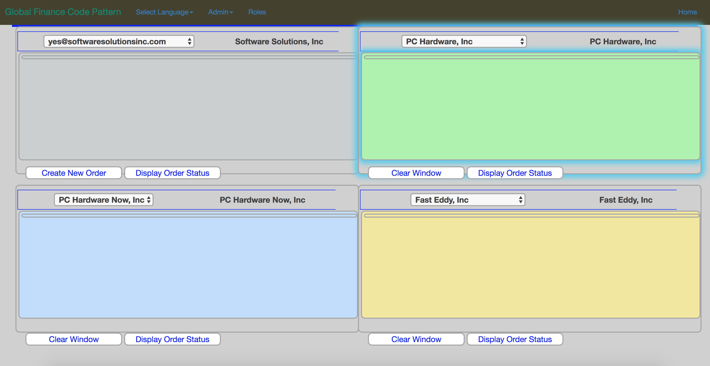

# Global Financing with Blockchain

The Global Finance application with Blockchain demonstrates tracking actions to an order by the different members on the network - Buyer, Seller, Provider, Shipper, Finance Company. These actions include creating the order once a Buyer creates it, next, as the Seller contacts a Provider for the items. The tracking continues with the Shipper as the items are delivered, and finally as payments are processed to the Seller by the Finance Company. This use case addresses disputes resolution and can be applied across industry verticals to resolve disputes. This use case is demonstrated through a Node.js smart contract and a Node.js we application.

The code pattern demonstrates how the Node.js smart contract can be packaged using the IBM Blockchain Platform Extension for VSCode. Then using the extension, we can setup a local instance of Hyperledger Fabric network, on which we can install and instantiate the contract.  The Node.js web application can interact with the network using the 'fabric-network' sdk.

When you have completed this code pattern, you will understand how to:

* Develop a Node.js smart contract
* Package and deploy the smart contract to a local instance of Hyperledger Fabric using IBM Blockchain Platform Extension for VSCode
* Develop a Node.js blockchain web application to interact with the deployed Fabric network


# Architecture Flow

<p align="center">
  
</p>

1. Developer can create and package the smart using Visual Code and IBM Blockchain Platform Extension for VSCode
2. The packaged contract can be deployed on a local instance of Hyperledger Fabric using the IBM Blockchain Platform Extension for VSCode
3. The Global Finance application interacts with the Hyperledger Fabric network through API calls using the fabric-network npm library.
4. The members of the network including the buyers, sellers, providers, shippers and the finance company, can update an order through the Global Finance application.  The admin can create new members and an option to pre-load with members.


# Included Components

* [IBM Blockchain Platform Extension for VSCode](https://marketplace.visualstudio.com/items?itemName=IBMBlockchain.ibm-blockchain-platform) The IBM Blockchain Platform extension has been created to assist users in developing, testing, and deploying smart contracts; including connecting to Hyperledger Fabric environments.
* [Hyperledger Fabric v1.3](https://hyperledger-fabric.readthedocs.io) Hyperledger Fabric is a platform for distributed ledger solutions, underpinned by a modular architecture delivering high degrees of confidentiality, resiliency, flexibility and scalability.
* [Visual Studio Code](https://code.visualstudio.com/download) Visual Studio Code is a code editor redefined and optimized for building and debugging modern web and cloud applications.

## Featured technology
+ [Nodejs](https://www.python.org/) Node.js is an open-source, cross-platform JavaScript run-time environment that executes JavaScript code server-side
+ [Bootstrap](https://getbootstrap.com/) Bootstrap is an open source toolkit for developing with HTML, CSS, and JS

## Running the Application

Follow these steps to setup and run this code pattern. The steps are described in detail below.

### Prerequisite

You will need the requirements for the [IBM Blockchain Platform Extension for VSCode](https://github.com/IBM-Blockchain/blockchain-vscode-extension/blob/master/README.md#requirements)

- [VSCode version 1.26 or greater](https://code.visualstudio.com)
- [Node v8.x or greater and npm v5.x or greater](https://nodejs.org/en/download/)
- [Yeoman (yo) v2.x](http://yeoman.io/)
- [Docker version v17.06.2-ce or greater](https://www.docker.com/get-docker)
- [Docker Compose v1.14.0 or greater](https://docs.docker.com/compose/install/)

### Steps

1. [Clone the repo](#1-clone-the-repo)
2. [Use VS Code extension to setup smart contract on a basic fabric network](#2-use-vs-code-extension-to-setup-smart-contract-on-a-basic-fabric-network)
3. [Run the application](#3-run-the-application)

You can also find steps to [setup fabric network here](./docs/setup-local-network.md) locally by scripts provided by the [fabric-samples](https://github.com/hyperledger/fabric-samples) repo.

## 1. Clone the repo

Clone this repository in a folder your choice
```
git clone https://github.com/raheelzubairy/global-financing-blockchain.git
```


## 2. Use VS Code extension to setup smart contract on a basic fabric network

Open Visual Studio code and open the `contract` folder

### Package the smart contract

Press `F1` key to see the different VS code options. Here choose `IBM Blockchain Platform: Package a Smart Contract Project`

<p align="center">
  
</p>

Click the `IBM Blockchain Platform` extension button on the left.  This will show the packaged contracts on top, and the blockchain connections on the bottom.

<p align="center">
  
</p>

### Setup local_fabric

Click on `local_fabric` to start a network. This will download the docker images required for a local fabric setup, and start the network. You should see in the output window as the network setups.

<p align="center">
  
</p>

Click on `local_fabric` again which should have a full white circle next to it.  This should bring up `mychannel`. You are now ready to install the small contract.


### Install and Instantiate the Smart Contract

Click on `mychannel`, then `Peers`.  This will display `peer0.org1.example.com`.  Right click on it and choose `Install Smart Contract`.

<p align="center">
  
</p>

Choose the `globalfinancing@0.0.1` contract.

<p align="center">
  
</p>

You are now ready to instantiate the smart contract. Right click on `mychannel` and choose `Instantiate Smart Contract`.

<p align="center">
  
</p>

Choose the `globalfinancing@0.0.1` contract.

<p align="center">
  
</p>

Type in `instantiate` for the function

<p align="center">
  
</p>

You can press "Enter" for optional arguments.  
Once successfully instantiated, you should see the contract in your Blockchain Connection with all the contract functions.

<p align="center">
  
</p>

You can directly submit transactions from here.  Once you have reviewed the contract, this would be a great place to try out the transactions directly to register participants and trying functions to update the order.

## 3. Run the Application

Before running the application, we need to update the ports in the [network-vs.yaml](web-app/controller/restapi/features/fabric/network-vs.yaml) file.  

* First in your terminal, type in `docker ps`.  This will display your docker containers.

<p align="center">
  
</p>

* Update the [network-vs.yaml](web-app/controller/restapi/features/fabric/network-vs.yaml) file with the ports for the peers, orderer and certificate-authority .

<p align="center">
  
</p>

<p align="center">
  
</p>

<p align="center">
  
</p>


* In a terminal, navigate to the `web-app` directory:

  ```bash
  cd application/
  ```

  Build the node dependencies:
  ```bash
  npm install
  ```

  Run the application:
  ```bash
  npm start
  ```

<div style='border: 2px solid #f00;'>
  
</div>

Unified member's view:
<div style='border: 2px solid #f00;'>
  
</div>

## Extending Code Pattern
This application can be expanded in several ways:
* Creating a wallet for every member and using the member's wallet to interact with the application
* Updating the application to interact through IBM Blockchain Platform starter plan on IBM Cloud


## Links
* [Hyperledger Fabric Docs](http://hyperledger-fabric.readthedocs.io/en/latest/)
* [Zero to Blockchain](https://www.redbooks.ibm.com/Redbooks.nsf/RedbookAbstracts/crse0401.html?Open)
* [IBM Code Patterns for Blockchain](https://developer.ibm.com/patterns/category/blockchain/)

## License
[Apache 2.0](LICENSE)
