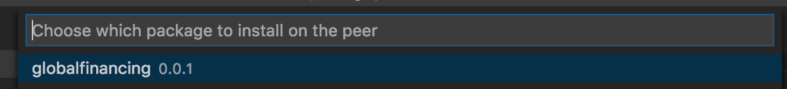
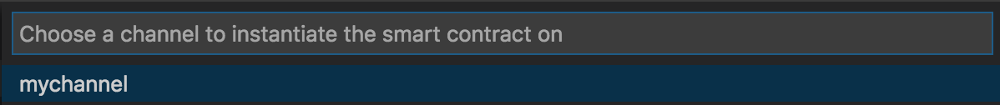
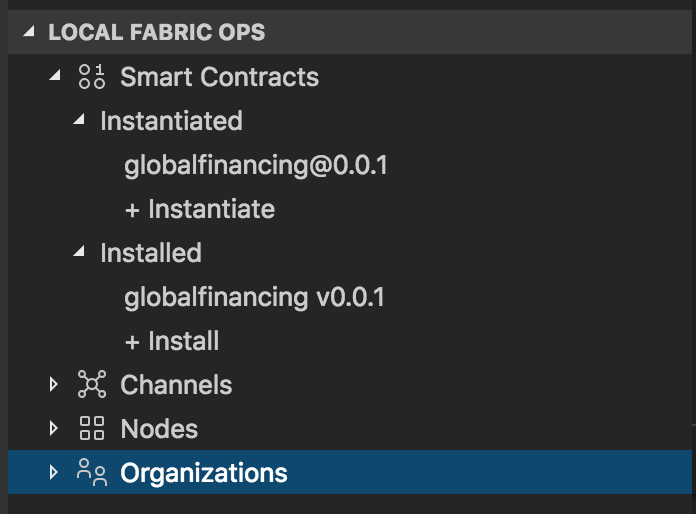
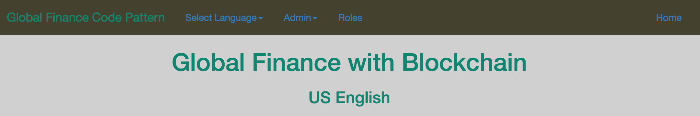

# Global financing with blockchain

The Global Finance application using blockchain technology tracks actions on an order by the various members of a network -- buyer, seller, provider, shipper, and finance company. These actions include:

* Buyer creates the order
* Seller contacts a provider for the items
* Shipper delivers the items
* Finance company processes payments to the seller

This use case addresses dispute resolution and can be applied across industry verticals to resolve disputes. This [use case](https://www.redbooks.ibm.com/Redbooks.nsf/RedbookAbstracts/crse0401.html?Open) is inspired by the RedBook tutorial by Bob Dill and uses the same application interface. This use case employs a Node.js smart contract and a Node.js web application.

The code pattern demonstrates how a Node.js smart contract can be packaged using the IBM Blockchain Platform Extension for VS Code. Then, using the extension, you can set up a local instance of the Hyperledger Fabric network, on which you can install and instantiate the contract. The Node.js web application can interact with the network using the 'fabric-network' sdk.

When you have completed this code pattern, you will understand how to:

* Develop a Node.js smart contract
* Package and deploy the smart contract to a local instance of Hyperledger Fabric using IBM Blockchain Platform Extension for VS Code
* Develop a Node.js blockchain web application to interact with the deployed Fabric network


# Architecture flow

<p align="center">
  
</p>

The developer uses the IBM Blockchain Platform Extension for VS Code to:

1. Package a smart contract.
1. Launch a local Hyperledger Fabric Network.
1. Install chaincode on the peer node.
1. Instantiate the chaincode on the peer node.
1. Use a Global Finance application to interact with the Hyperledger Fabric network through API calls using the `fabric-network` npm library. Admins can also use the application to create new participants.

# Included components

* [IBM Blockchain Platform Extension for VS Code](https://marketplace.visualstudio.com/items?itemName=IBMBlockchain.ibm-blockchain-platform) is designed to assist users in developing, testing, and deploying smart contracts -- including connecting to Hyperledger Fabric environments.
* [Hyperledger Fabric v1.4](https://hyperledger-fabric.readthedocs.io) is a platform for distributed ledger solutions, underpinned by a modular architecture that delivers high degrees of confidentiality, resiliency, flexibility, and scalability.
* [Visual Studio Code](https://code.visualstudio.com/download) is a code editor that's redefined and optimized for building and debugging modern web and cloud applications.

## Featured technologies
+ [Node.js](https://nodejs.org/en/) is an open source, cross-platform JavaScript run-time environment that executes server-side JavaScript code.
+ [Bootstrap](https://getbootstrap.com/) is an open source toolkit for developing with HTML, CSS, and JavaScript.

## Running the application

Follow these steps to set up and run this code pattern. The steps are described in detail below.

### Prerequisites

You will need to follow the requirements for the [IBM Blockchain Platform Extension for VS Code](https://github.com/IBM-Blockchain/blockchain-vscode-extension/blob/master/README.md#requirements):

- [VSCode version 1.26 or greater](https://code.visualstudio.com)
- [Node v8.x or greater and npm v5.x or greater](https://nodejs.org/en/download/)
- [Yeoman (yo) v2.x](http://yeoman.io/)
- [Docker version v17.06.2-ce or greater](https://www.docker.com/get-docker)
- [Docker Compose v1.14.0 or greater](https://docs.docker.com/compose/install/)

### Steps

1. [Clone the repo](#1-clone-the-repo)
2. [Use the VS Code extension to set up a smart contract on a basic Fabric network](#2-use-the-vs-code-extension-to-set-up-a-smart-contract-on-a-basic-fabric-network)
3. [Run the application](#3-run-the-application)


## 1. Clone the repo

Clone this repository in a folder your choice:

```
git clone https://github.com/IBM/global-financing-blockchain.git
```


## 2. Use the VS Code extension to set up a smart contract on a basic Fabric network

Open Visual Studio code and open the `contract` folder.

### Package the smart contract

Press the `F1` key to see the different VS code options. Choose `IBM Blockchain Platform: Package a Smart Contract Project`.

<p align="center">
  
</p>

Click the `IBM Blockchain Platform` extension button on the left. This will show the packaged contracts on top and the blockchain connections on the bottom.

<p align="center">
  
</p>

### Setup fabric locally

Click on the menu for `LOCAL FABRIC OPS`, and choose `Start Fabric Runtime` to start a network. This will download the Docker images required for a local Fabric setup, and start the network. You should see the output window as the network sets up.

<p align="center">
  
</p>

You should now see under `LOCAL FABRIC OPS`, options to install and instantiate smart contract, your `Channels` information, your peer under `Nodes` and the organization msp under `Organizations`  You are now ready to install the smart contract.

<p align="center">
  
</p>

### Install and instantiate the smart contract

Click on `+Install` under `Installed` dropdown in the `LOCAL FABRIC OPS` console.

Choose the peer: `peer0.org1.example.com`.

<p align="center">
  
</p>

Choose the `globalfinancing@0.0.1` contract:

<p align="center">
  
</p>

You should see a notification for successful install of the smart contract, and the smart contract listed under `Installed` in your `LOCAL FABRIC OPS` console.

<p align="center">
  
</p>


You are now ready to instantiate the smart contract.
Click on `+Instantiate` under `Instantiated` dropdown in the `LOCAL FABRIC OPS` console.

Choose the channel: `my channel`.

<p align="center">
  
</p>

Choose the `globalfinancing@0.0.1` contract:

<p align="center">
  
</p>

Type in `instantiate` for the function:

<p align="center">
  
</p>

You can press **Enter** for optional arguments.  

Once this is successfully instantiated, you should see a successful notification in the output view, and the smart contract listed under `Instantiated` in your `LOCAL FABRIC OPS` console.

<p align="center">
  
</p>


## 3. Run the application

In a new terminal, navigate to the `web-app` directory:

  ```bash
  cd global-financing-blockchain/web-app/
  ```

  Build the node dependencies:
  ```bash
  npm install
  ```

  Run the application:
  ```bash
  npm start
  ```

<div style='border: 2px solid #f00;'>
  
</div>

Unified member's view:
<div style='border: 2px solid #f00;'>
  
</div>

## Extending the code pattern
This application can be expanded in a couple of ways:
* Create a wallet for every member and use the member's wallet to interact with the application.
* Update the application to interact through the IBM Blockchain Platform starter plan on IBM Cloud.


## Links
* [Hyperledger Fabric Docs](http://hyperledger-fabric.readthedocs.io/en/latest/)
* [Zero to Blockchain](https://www.redbooks.ibm.com/Redbooks.nsf/RedbookAbstracts/crse0401.html?Open)
* [IBM Code Patterns for Blockchain](https://developer.ibm.com/patterns/category/blockchain/)

## License
This code pattern is licensed under the Apache Software License, Version 2. Separate third-party code objects invoked within this code pattern are licensed by their respective providers pursuant to their own separate licenses. Contributions are subject to the [Developer Certificate of Origin, Version 1.1 (DCO)](https://developercertificate.org/) and the [Apache Software License, Version 2](https://www.apache.org/licenses/LICENSE-2.0.txt).

[Apache Software License (ASL) FAQ](https://www.apache.org/foundation/license-faq.html#WhatDoesItMEAN)
